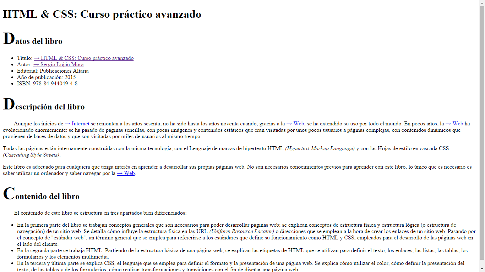

## Enunciado
A partir de la página web que se te proporciona, debes escribir las reglas CSS necesarias para lograr una página web que tenga el mismo aspecto que la siguiente imagen:



Debes utilizar los selectores avanzados para lograr que:

*   La primera letra de un encabezado de nivel 2 se muestre con un tamaño más grandes.
*   El primer párrafo después de cada encabezado de nivel 2 tenga un sangrado 2em en la primera línea.
*   Al principio de un enlace se muestre la flecha "→".
*   Después de una abreviatura se muestre el significado de la abreviatura.


Código base
```
<!DOCTYPE html>
<html>
<head>
<meta charset="utf-8" />
<title>HTML &amp; CSS: Curso práctico avanzado</title>
</head>
<body>
<h1>HTML &amp; CSS: Curso práctico avanzado</h1>

<h2>Datos del libro</h2>

<ul>
<li>Título: <a href="http://publicacionesaltaria.com/es/tienda/112-html-css-curso-practico.html">HTML &amp; CSS: Curso práctico avanzado</a></li>
<li>Autor: <a href="http://sergiolujanmora.es/">Sergio Luján Mora</a></li>
<li>Editorial: Publicaciones Altaria</li>
<li>Año de publicación: 2015</li>
<li>ISBN: 978-84-944049-4-8</li>
</ul>


<h2>Descripción del libro</h2>

<p>
Aunque los inicios de <a href="https://es.wikipedia.org/wiki/Internet">Internet</a> se remontan a los años sesenta, no ha sido hasta los años noventa cuando, gracias a la <a href="https://es.wikipedia.org/wiki/World_Wide_Web">Web</a>, se ha extendido su uso por todo el mundo. En pocos años, la <a href="https://es.wikipedia.org/wiki/World_Wide_Web">Web</a> ha evolucionado enormemente: se ha pasado de páginas sencillas, con pocas imágenes y contenidos estáticos que eran visitadas por unos pocos usuarios a páginas complejas, con contenidos dinámicos que provienen de bases de datos y que son visitadas por miles de usuarios al mismo tiempo.
</p>

<p>
Todas las páginas están internamente construidas con la misma tecnología, con el Lenguaje de marcas de hipertexto <abbr title="Hypertext Markup Language">HTML</abbr> y con las Hojas de estilo en cascada <abbr title="Cascading Style Sheets">CSS</abbr>.
</p>

<p>
Este libro es adecuado para cualquiera que tenga interés en aprender a desarrollar sus propias páginas web. No son necesarios conocimientos previos para aprender con este libro, lo único que es necesario es saber utilizar un ordenador y saber navegar por la <a href="https://es.wikipedia.org/wiki/World_Wide_Web">Web</a>.
</p>


<h2>Contenido del libro</h2>

<p>
El contenido de este libro se estructura en tres apartados bien diferenciados:
</p>

<ul>
<li>En la primera parte del libro se trabajan conceptos generales que son necesarios para poder desarrollar páginas web; se explican conceptos de estructura física y estructura lógica (o estructura de navegación) de un sitio web. Se detalla cómo influye la estructura física en las <abbr title="Uniform Resource Locator">URL</abbr> o direcciones que se emplean a la hora de crear los enlaces de un sitio web. Pasando por el concepto de "estándar web", un término general que se emplea para refererirse a los estándares que define su funcionamiento como HTML y CSS, empleados para el desarrollo de las páginas web en el lado del cliente.</li>

<li>En la segunda parte se trabaja HTML. Partiendo de la estructura básica de una página web, se explican las etiquetas de HTML que se utilizan para definir el texto, los enlaces, las listas, las tablas, los formularios y los elementos multimedia.</li>

<li>En la tercera y última parte se explica CSS, el lenguaje que se emplea para definir el formato y la presentación de una página web. Se explica cómo utilizar el color, cómo definir la presentación del texto, de las tablas y de los formularios; cómo realizar transformaciones y transiciones con el fin de diseñar una página web.</li>
</ul>
</body>
</html>
```