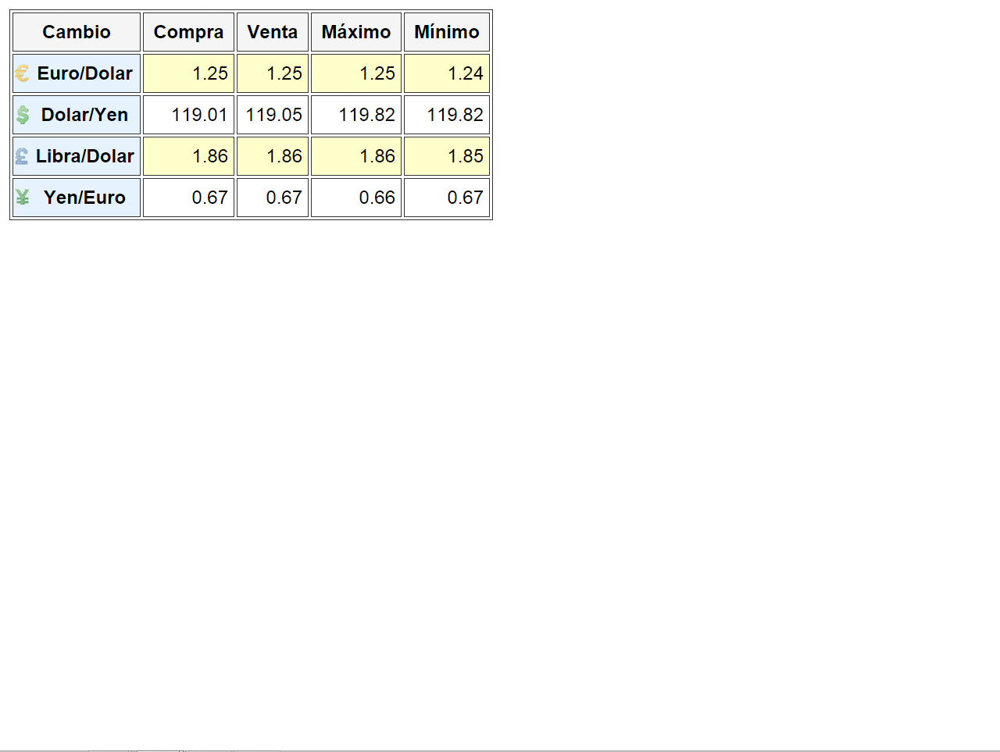

## Enunciado
A partir de la página web que se te proporciona, debes escribir las reglas CSS necesarias para lograr una página web que tenga el mismo aspecto que la siguiente imagen:



En la imagen anterior se muestra lo que debe ocurrir al situar el cursor del ratón sobre una de las filas de datos de la tabla: el color de fondo de las celdas debe cambiar a amarillo (#FFFF66).

Nota: busca en Internet las imágenes necesarias para representar los símbolos de las diferentes monedas. Las imágenes las debes colocar como imágenes decorativas desde CSS.


Código base
```
<!DOCTYPE html>
<html>
<head>
<meta charset="utf-8" />
<title>Ejemplo de selectores avanzados</title>
</head>
<body>
<table>
  <tr>
    <th>Cambio</th>
    <th>Compra</th>
    <th>Venta</th>
    <th>Máximo</th>
    <th>Mínimo</th>
  </tr>
  <tr>
    <th class="euro">Euro/Dolar</th>
    <td>1.25</td>
    <td>1.25</td>
    <td>1.25</td>
    <td>1.24</td>
  </tr>
  <tr>
    <th class="dolar">Dolar/Yen</th>
    <td>119.01</td>
    <td>119.05</td>
    <td>119.82</td>
    <td>119.82</td>
  </tr>
  <tr>
    <th class="libra">Libra/Dolar</th>
    <td>1.86</td>
    <td>1.86</td>
    <td>1.86</td>
    <td>1.85</td>
  </tr>
  <tr>
    <th class="yen">Yen/Euro</th>
    <td>0.67</td>
    <td>0.67</td>
    <td>0.66</td>
    <td>0.67</td>
  </tr>
</table>
</body>
</html>
```