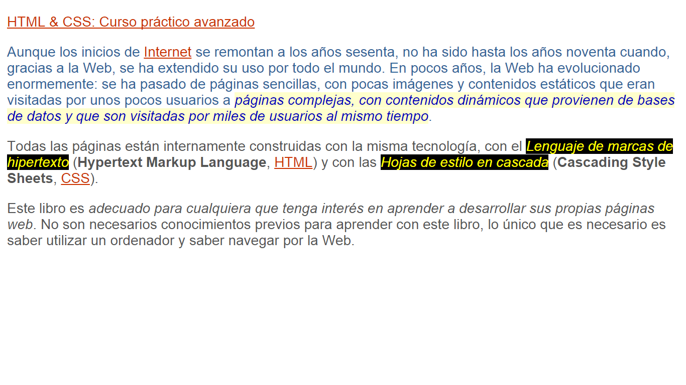

## Enunciado
A partir de la página web que se te proporciona, debes añadir los selectores a las reglas CSS para aplicar los estilos deseados y crear una página web que tenga el mismo aspecto que la siguiente imagen:



Cada regla CSS incluye un comentario en el que se explica los elementos a los que debe aplicarse.

## Código Base
````
<!DOCTYPE html>
<html>
<head>
<meta charset="utf-8" />
<title>Ejercicio de selectores</title>
<style>
/* Todos los elementos de la pagina */
{
  font-size: 16px;
  font-family: Arial, Helvetica, sans-serif;
}

/* Todos los parrafos de la pagina */
{
  color: #555;
}

/* Todos los párrafos contenidos en #primero */
{
  color: #369;
}

/* Todos los enlaces la pagina */
{
  color: #C30;
}

/* Los elementos <em> contenidos en #primero */
{
  color: #0000BB;
  background-color: #FFFFCC;
}

/* Todos los elementos <em> con la clase "especial" en toda la pagina */
{
  color: #FFFF00;
  background: #000000;
}

/* Todos los elementos <span> contenidos en la clase "normal" */
{
  font-weight: bold;
}
</style>
</head>

<body>

<div id="primero">
<p>
<a href="http://publicacionesaltaria.com/es/tienda/112-html-css-curso-practico.html">HTML &amp; CSS: Curso práctico avanzado</a>
</p>

<p>
Aunque los inicios de <a href="https://es.wikipedia.org/wiki/Internet">Internet</a> se remontan a los años sesenta, no ha sido hasta los años noventa cuando, gracias a la Web, se ha extendido su uso por todo el mundo. En pocos años, la Web ha evolucionado enormemente: se ha pasado de páginas sencillas, con pocas imágenes y contenidos estáticos que eran visitadas por unos pocos usuarios a <em>páginas complejas, con contenidos dinámicos que provienen de bases de datos y que son visitadas por miles de usuarios al mismo tiempo</em>.
</p>
</div>

<div id="segundo" class="normal">
<p>
Todas las páginas están internamente construidas con la misma tecnología, con el <em class="especial">Lenguaje de marcas de hipertexto</em> (<span>Hypertext Markup Language</span>, <a href="https://es.wikipedia.org/wiki/HTML">HTML</a>) y con las <em class="especial">Hojas de estilo en cascada</em> (<span>Cascading Style Sheets</span>, <a href="https://es.wikipedia.org/wiki/CSS">CSS</a>).
</p>

<p>
Este libro es <em>adecuado para cualquiera que tenga interés en aprender a desarrollar sus propias páginas web</em>. No son necesarios conocimientos previos para aprender con este libro, lo único que es necesario es saber utilizar un ordenador y saber navegar por la Web.
</p>
</div>

</body>
</html>
````
