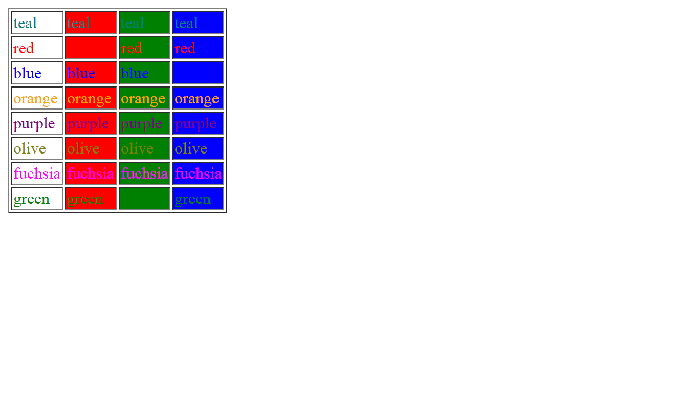

## Enunciado
A partir de la página web que se te proporciona, debes escribir las reglas CSS necesarias para lograr una página web que tenga el mismo aspecto que la siguiente imagen:



Puedes modificar el código HTML proporcionado para añadir los identificadores y clases que necesites.

En la tabla se indican los nombres de los colores que debes emplear.

Debes intentar utilizar el mínimo número posible de reglas y selectores de CSS.

## Código Base
````
<!DOCTYPE html>
<html>
  <head>
    <meta charset="utf-8" />
    <title>Ejercicio de selectores</title>
  </head>
  <body>
    <table border="1">
      <tr><td>teal</td><td>teal</td><td>teal</td></tr>
      <tr><td>red</td><td>red</td><td>red</td></tr>
      <tr><td>blue</td><td>blue</td><td>blue</td></tr>
      <tr><td>orange</td><td>orange</td><td>orange</td></tr>
      <tr><td>purple</td><td>purple</td><td>purple</td></tr>
      <tr><td>olive</td><td>olive</td><td>olive</td></tr>
      <tr><td>fuchsia</td><td>fuchsia</td><td>fuchsia</td></tr>
      <tr><td>green</td><td>green</td><td>green</td></tr>
    </table>
  </body>
</html>
````
