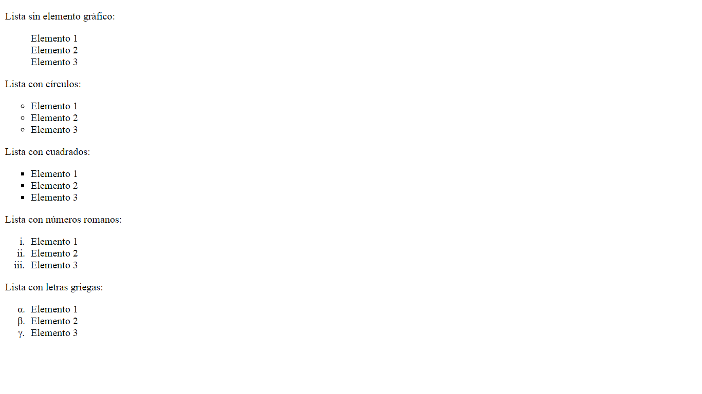

## Enunciado
A partir de la página web que se te proporciona, debes escribir las reglas CSS necesarias para lograr una página web que tenga el mismo aspecto que la siguiente imagen:



Puedes modificar el código HTML proporcionado para añadir los identificadores y clases que necesites.


````
<!DOCTYPE html>
<html>
<head>
<meta charset="utf-8" />
<title>Ejemplo de listas</title>
</head>
<body>
<p>Lista sin elemento gráfico:</p>
<ul>
<li>Elemento 1</li>
<li>Elemento 2</li>
<li>Elemento 3</li>
</ul>

<p>Lista con círculos:</p>
<ul>
<li>Elemento 1</li>
<li>Elemento 2</li>
<li>Elemento 3</li>
</ul>

<p>Lista con cuadrados:</p>
<ul>
<li>Elemento 1</li>
<li>Elemento 2</li>
<li>Elemento 3</li>
</ul>

<p>Lista con números romanos:</p>
<ol>
<li>Elemento 1</li>
<li>Elemento 2</li>
<li>Elemento 3</li>
</ol>

<p>Lista con letras griegas:</p>
<ol>
<li>Elemento 1</li>
<li>Elemento 2</li>
<li>Elemento 3</li>
</ol>
</body>
</html>
````
